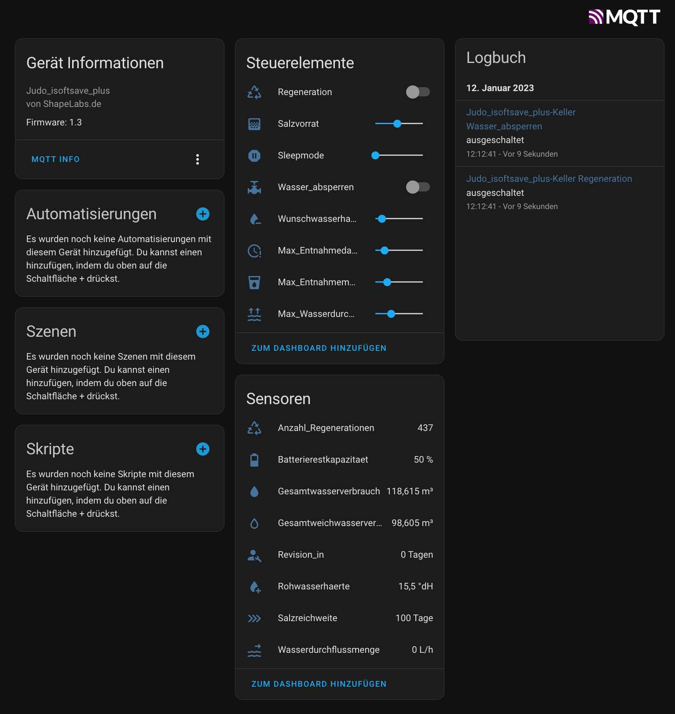

# Judo i-soft save+ to mqtt bridge for homeassistant


This is a small workarount to read and control the Judo isoft safe+ water softener with homeassisant (hassio). It is the version with the small character-lcd and leakage protection.

Unfortunately it is not possible to communicate directly with this version of the plant. Port 8000 and port 8124, through which the system can be read out on the Judo isoft-plus, are closed. The only way to access settings and data is via the cloud server.

Notice:
There are 2 versions of the system, which sound very similar.
- i-soft safe+ (small display, leakage protection) --->This repo
- i-soft plus (large graphic display) ---> another tutorials, like this: https://blog.muwave.de/2017/06/monitoring-and-controlling-a-judo-i-soft-plus-water-softening-device-via-lan/

To do this, you must register the system for the cloud service as described in the user manual and create a user account. There is also a judo smartphone app for this, but it is of course nicer to have everything in homeassisant :-)

## Config:
General settings must be made in the config file. 
 - First there are the access data to the myjudo.eu server.
 - Furthermore there are the MQTT broker settings. The IP of the MQTT broker must be specified here, as well as the access data to the broker.
- General settings like location and name should also be defined. This results in the MQTT topic
- In addition, the language can be set between German and English, as well as the MQTT debug level. As default user the value "1" is recommended.
- At last you have to set in the script in which environment it should run, see following instructions, there are two ways to run this script:

### Running on a generic Linux platform:
The requirement is of course that a Python environment is installed on the Linux:
```
$ sudo apt update && upgrade
$ sudo apt install python3-pip
 ```

It may still be necessary to install the paho-mqtt package:
```
$sudo pip install paho-mqtt
```

Copy/Clone the repo to your home-folder or wherever you want. Rename the config_getjudo_default.py 
```
mv config_getjudo_default.py config_getjudo.py
```

Do the settings in config_getjudo.py , see @ Chapter "Config"
After that you can start the script. On Linux platforms it is best to include it in the systemd-manager.
To do this, create a new systemd-service:
```
$sudo nano /etc/systemd/system/getjudo.service
```
```
[Unit]
Description=getjudo service
After=multi-user.target
[Service]
Type=simple
Restart=always
ExecStart=/usr/bin/python3 /home/<username>/getjudo.py
[Install]
WantedBy=multi-user.target
```
User rights may still need to be assigned:
```
sudo chmod +x /etc/systemd/system/getjudo.service && chmod +x ~/*getjudo.py
```
Reload the daemon:
```
$sudo systemctl daemon-reload
```
Enable the autostart, if our platform restarts e.g.:
```
$sudo systemctl enable getjudo.service
```
Start the service:
```
$sudo systemctl start getjudo.service
```


### Running in AppDeamon docker directly in HomeAssistant (experimental; work in progress)
0. MQTT should be already setup and running
1. Install AppDaemon and Studio Code Server (Optional) through HomeAssistant Add-Ons store (https://community.home-assistant.io/t/home-assistant-community-add-on-appdaemon-4/163259)
2. Configure AppDaemon with the following settings:
```
init_commands: []
python_packages:
  - paho-mqtt
system_packages:
```

3. Copy all files from the python folder into the folder appdaemon/apps/main (incl. temp_getjudo.py) -> Studio Code Server . Rename config_getjudo_default.py to config_getjudo.py 
4. Modify the apps.yaml file:

```
main_app:
  module: main_entity
  class: main_loop
```

5. Modify config_judo.py to your system
6. Start AppDaemon and check the logs for potential errors
7. You can easily add more scripts into main_entity.py -> main file, where all scripts are called

-> the getjudo.py can be also started from a local Win10 VSCode installation, for easier tests of the config (after adding python through extensions and paho-mqtt with pip install)


### Startup
Afterwards the device should set itself up automatically with mqtt-autoconfig in homeassitant with all entities:



- reading (sensors): 
  - next revision
  - total water consumption
  - total softwater consumption
  - total hardwater consumption
  - salt range
  - output hardness
  - input hardness
  - water flow
  - capacity of battery
  - number of regenerations
  - daily consumption (today)
  - daily consumption (yesterday)
- writing:
  - leakage protection (switch)
  - output hardness (input number slider)
  - salt stock (input number slider)
  - triggering regeneration (switch)
  - sleepmode (input number slider) (start sleepmode by setting hours) 
  - max. extraction time, leakage protection config (input number slider)
  - max. extraction quantity, leakage protection config (input number slider)
  - max. waterflow, leakage protection config (input number slider)
  - Holiday mode
- other:
  - Error- and warning messages of plant published to notification topic (LOCATION/NAME/notify). Can be used for hassio telegram bot:


```
#This is an example template, how to configure the notification as automation for Telegram-Bot

#Trigger:
platform: mqtt
topic: Keller/Judo_isoftsaveplus/notify

#Action:
service: notify.ha_message
data:
  message: "Judo I-soft SAVE+: {{states(\"sensor.judo_isoftsaveplus_keller_meldung\")}}"
```


###  !!!!Attention!!!! 
**Don't post/mail or publish your generated Token anywhere. It allows grand access to the plant!**


### This Project based of informations from:
- https://blog.muwave.de/2017/06/monitoring-and-controlling-a-judo-i-soft-plus-water-softening-device-via-lan/
- https://forum.fhem.de/index.php/topic,115696.15.html
- https://knx-user-forum.de/forum/projektforen/edomi/1453632-lbs19002090-judo-i-soft-wasserenth%C3%A4rtungsanlage/page2
- https://myjudo.eu (Javascript-Files)

Many thanks to this guys!!!

